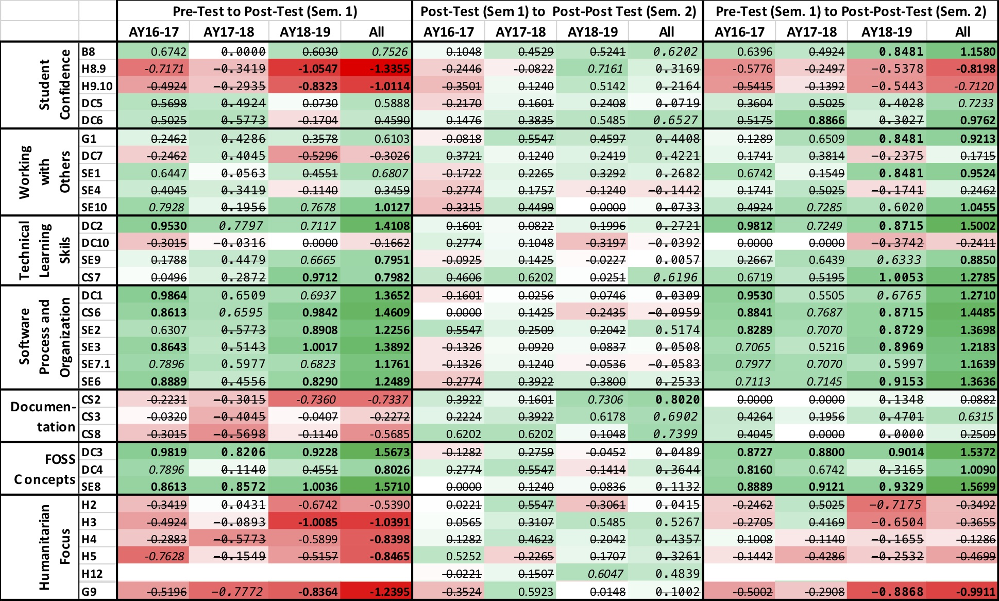

# Dickinson H/FOSS - Capstone

## Introduction:

This repository contains materials that support the integration of Free and Open Source Software (FOSS) experiences and more specifically student participation in a Humanitarian FOSS (HFOSS) community into a year-long capstone experience in computer science. These materials support an _in the wild_ approach where students self-select an H/FOSS (FOSS or HFOSSS) project and participate directly in its community. A discussion of this approach and a comparison of it to other possible H/FOSS capstone approaches can be found in:

*	Braught, G., MacCormick, J., Bowring, J., Burke, Q., Cutler, B., Goldschmidt, D., Krishnamoorthy, M., Turner, W., Huss-Lederman, S., Mackellar, B. and Tucker, A. (2018). [A Multi-Institutional Perspective on H/FOSS Projects in the Computing Curriculum](https://doi.org/10.1145/3145476). ACM Transactions on Computing Education. 18(2), Article 7 (July 2018), 31 pages.

This repository will focus solely on the materials for the _in the wild_ approach developed in the [Department of Computer Science](https://www.dickinson.edu/homepage/57/computer_science) at [Dickinson College](https://www.dickinson.edu/). We began using this approach in fall 2016 and these materials have been added to and refined in each of the two years since, and they will continue to evolve over time. However, this repository will remain a static point of reference in their development. Please feel free to reach out if you are interested in the most recent materials.

## Course Context:

The Senior Seminar in computer science at Dickinson is a year-long capstone experience consisting of a full course in both the fall and spring semesters and is required of all computer science majors during their final year. Students in the seminar engage in either an H/FOSS project or in an honors research project.  The materials in this repository focus solely on the materials that support the H/FOSS project option. The course meets for 75 minutes twice per week for 14 weeks plus a three-hour final exam period each semester.

The goal of participation in an H/FOSS project is to provide a transition from the study of computer science at the undergraduate level to experiences more aligned with professional practices. Students gain experience working on a large on-going project, learning new project specific tools and processes, reading and modifying code created by others and interacting with a professional level developer community. In addition, the senior seminar includes relevant technical skill development and professional preparation though exposure to a variety of topics in software engineering, and readings and discussions of contemporary social/legal/ethical issues in computing.

Prior to taking this capstone all majors will have completed the core courses including a two-course introductory sequence in Java, a data structures course in Java and a computer organization and architecture course.  Students will also have completed or be taking concurrently courses including: analysis of algorithms, theory of computation, programming language structures and operating systems or computer networks.

At the time these materials were developed and refined our curriculum contained little formal introduction to H/FOSS, system administration, version control or Unix tools prior to the capstone. Thus, the materials below provide much of that background material as well as guiding the students into participation in their chosen H/FOSS communities. Based on our experiences this senior capstone we have significantly redesigned our curriculum (beginning fall 2019) so that the technical skill development necessary for H/FOSS participation as well as consideration for social/legal/ethical issues occurs earlier and is distributed across a number of courses. Our website contains the full details of the [computer science curriculum at Dickinson](https://www.dickinson.edu/homepage/402/computer_science_curriculum).

## Materials:

The [full website for the Senior Seminar (COMP 491/492)](https://raw.githack.com/braughtg/DickinsonHFOSS-SFC-Materials/master/cs491f18/cs491f18.html) is included in the [cs491f18](./cs491f18) folder in this repository. The items below link to the course elements that focus specifically on the H/FOSS aspects of the course. Materials that were used in discussions of software engineering and (non-HFOSS) social/legal/ethical issues are not included here but do appear on the full site linked above. The materials below are organized by topic and can be assembled into a full H/FOSS capstone course.

### Technical Skills Development
This set of activities, tutorials and homework exercises introduce students to many general tools and skills that are necessary for participation in FOSS projects.  They are completed as a combination of homework and in-class hands-on activities.

* [Blog/Slack/Wiki/GitHub](https://raw.githack.com/braughtg/DickinsonHFOSS-SFC-Materials/master/cs491f18/blogslackwiki.html)
* [Ubuntu Install](https://raw.githack.com/braughtg/DickinsonHFOSS-SFC-Materials/master/cs491f18/ubuntuinstall.html)
* [Unix Tools Challenges](https://raw.githack.com/braughtg/DickinsonHFOSS-SFC-Materials/master/cs491f18/unixtools.html)
* [Software Installation](https://raw.githack.com/braughtg/DickinsonHFOSS-SFC-Materials/master/cs491f18/swinstall.html)
* [GitHub Workflow](https://raw.githack.com/braughtg/DickinsonHFOSS-SFC-Materials/master/cs491f18/github.html)
* [Bash Scripting](https://raw.githack.com/braughtg/DickinsonHFOSS-SFC-Materials/master/cs491f18/bashscript.html)
* [Building an Open Source Project](https://raw.githack.com/braughtg/DickinsonHFOSS-SFC-Materials/master/cs491f18/build.html)
* [Getting Around in a FOSS Project](https://raw.githack.com/braughtg/DickinsonHFOSS-SFC-Materials/master/cs491f18/gettingaround.html)
* [Patching a FOSS Project](https://raw.githack.com/braughtg/DickinsonHFOSS-SFC-Materials/master/cs491f18/patch.html)

### H/FOSS Discussion Topics & Readings
Students are assigned readings on a variety of topics related to FOSS and H/FOSS. A class discussion following the completion of the readings explores and reinforces the most interesting and important points.  Following each discussion students write a reflective blog post exploring an aspect of the topic of interest to them.

* [H/FOSS History & Philosophy](https://raw.githack.com/braughtg/DickinsonHFOSS-SFC-Materials/master/cs491f18/cs491f18.html#0906)
* [H/FOSS Project Community](https://raw.githack.com/braughtg/DickinsonHFOSS-SFC-Materials/master/cs491f18/cs491f18.html#0913)
* [H/FOSS Project Tools/Structures/Communication](https://raw.githack.com/braughtg/DickinsonHFOSS-SFC-Materials/master/cs491f18/cs491f18.html#0917)
* [FOSS Licensing](https://raw.githack.com/braughtg/DickinsonHFOSS-SFC-Materials/master/cs491f18/cs491f18.html#1101)
* [H/FOSS Motivations](https://raw.githack.com/braughtg/DickinsonHFOSS-SFC-Materials/master/cs491f18/cs491f18.html#1206)
* [FOSS Success Stories and Criticisms](https://raw.githack.com/braughtg/DickinsonHFOSS-SFC-Materials/master/cs491f18/cs491f18.html#1210)

### H/FOSS Project Activities
The following set of activities form the core of the students' selection and participation in an H/FOSS project community.

* __Project Selection__ - These activities progressively build toward the formation of project teams and the selection of H/FOSS project communities.  Each activity lasts a week to a week and half.
  * __Activities__:
    * [H/FOSS Project Exploration](https://raw.githack.com/braughtg/DickinsonHFOSS-SFC-Materials/master/cs491f18/projexpl.html) - Students each identify and explore four H/FOSS projects that are of interest to them.
    * [H/FOSS Project Reviews](https://raw.githack.com/braughtg/DickinsonHFOSS-SFC-Materials/master/cs491f18/projrev.html) - Students dig deeper into the community and technical details of two of the H/FOSS projects that they explored.
    * [H/FOSS Project Ranking & Selection](https://raw.githack.com/braughtg/DickinsonHFOSS-SFC-Materials/master/cs491f18/projranking.html) - Teams of 2-4 are formed around general areas of interest and commonly reviewed projects. Teams evaluate and rank H/FOSS projects that the members have reviewed and select the one on which the team will work for the year.
* __Project Setup & Familiarization__ - Teams complete these activities to install and begin to familiarize themselves with their H/FOSS projects.  Teams of more than 3 sub-divide into sub-teams of 2-3 and each sub-team works independently. However, the sub-teams share information and provide assistance and guidance to each other. Each project is different. Some are easy to install and build, others are much more difficult. Thus, these activities do not have due dates. Rather they have completion criterion. When a team or sub-team can demonstrate that they have satisfied the completion criterion they move onto the next activity.
  * __Activities__
    * [User Installation](https://raw.githack.com/braughtg/DickinsonHFOSS-SFC-Materials/master/cs491f18/projinstalluser.html)
    * [Developer Installation](https://raw.githack.com/braughtg/DickinsonHFOSS-SFC-Materials/master/cs491f18/projinstalldev.html)
* __Project Contributions__ - Once familiar with the project and a working developer install has been completed, these activities guide the students through increasingly deep participation in their H/FOSS project communities.  Like the prior activities, these each have completion criterion rather than due dates as the effort involved in each will vary significantly from project to project. Most teams or sub-teams complete the Bug Gardening activity by the end of the first semester and the Bug Fixing activity by the end of the second semester.  Many teams or sub-teams make a variety of other contributions to their projects by the end of the year.
  * __Activities__
    * [Bug Gardening](https://raw.githack.com/braughtg/DickinsonHFOSS-SFC-Materials/master/cs491f18/projbuggardening.html)
    * [Bug Fixing](https://raw.githack.com/braughtg/DickinsonHFOSS-SFC-Materials/master/cs491f18/projbugfix.html)
    * [Project Contribution](https://raw.githack.com/braughtg/DickinsonHFOSS-SFC-Materials/master/cs491f18/projcontrib.html)

### Course Deliverables & Assessment
Assessment of student work is done through a number of deliverables and assessments.

* [Preparation / Attendance / Engagement (PAE)](https://raw.githack.com/braughtg/DickinsonHFOSS-SFC-Materials/master/cs491f18/syllabus.html#pae) - Students receive a mark for each of these elements for each class meeting.
* [Tutorials / Homework Exercises](https://raw.githack.com/braughtg/DickinsonHFOSS-SFC-Materials/master/cs491f18/syllabus.html#hw) - During the first semester, each of the technical skill development activities and project selection activities are graded.
* [Reflective Blog Postings](https://raw.githack.com/braughtg/DickinsonHFOSS-SFC-Materials/master/cs491f18/syllabus.html#blog) - Students write reflective blog posts following readings and class discussions.  These are assessed and feedback is provided at several points during each semester.
* [Project Selection](https://raw.githack.com/braughtg/DickinsonHFOSS-SFC-Materials/master/cs491f18/projpres.html) - Teams give a presentation on their selected H/FOSS project.
* [Code Review](https://raw.githack.com/braughtg/DickinsonHFOSS-SFC-Materials/master/cs491f18/coderev.html) - Individual students present a snippet of code from their H/FOSS project.
* [Poster Presentation](https://raw.githack.com/braughtg/DickinsonHFOSS-SFC-Materials/master/cs491f18/poster.html) - Teams produce and present a poster describing their year's work at a public poster sessions near the end of the second semester.

* [H/FOSS Project Checkpoints](https://raw.githack.com/braughtg/DickinsonHFOSS-SFC-Materials/master/cs491f18/syllabus.html#ProjCheckpoint) - Following the selection of the H/FOSS projects, teams progress through the H/FOSS Project Activities at different rates. Thus, assessment is done by evaluating the work done by each individual and each team at specified checkpoints rather than based on completion of the activities. Typically there are two checkpoints each semester, one mid-semester and one during the final exam period. At each checkpoint work is assessed along six dimensions:
  * _Daily Reporting_ - Teams or sub-teams maintain [Slack Live-Logs](https://raw.githack.com/braughtg/DickinsonHFOSS-SFC-Materials/master/cs491f18/syllabus.html#SlackLiveLog) as they work detailing what they try, what works, what doesn't work and what resources they have used.  This provides a useful record for the students and a fine grained documentation of their efforts.
  * _Individual Weekly Reporting_ - Each student writes an (approximately) weekly [Five-Fifteen Report](https://raw.githack.com/braughtg/DickinsonHFOSS-SFC-Materials/master/cs491f18/syllabus.html#fivefifteen) reflecting on their individual work over the past week and setting goals for the next week.
  * _Team Weekly Reporting_ - Each team writes an (approximately) weekly [Five-Fifteen Report](https://raw.githack.com/braughtg/DickinsonHFOSS-SFC-Materials/master/cs491f18/syllabus.html#fivefifteen) reflecting on the team's work over the past week and setting goals for the next week.
  * _Team Checkpoint Presentation_ - At each checkpoint, each team gives a presentation summarizing their work to date.
    * [Mid-Semester Checkpoints](https://raw.githack.com/braughtg/DickinsonHFOSS-SFC-Materials/master/cs491f18/syllabus.html#ProjCheckpoint)
    * [End of Fall Semester](https://raw.githack.com/braughtg/DickinsonHFOSS-SFC-Materials/master/cs491f18/sem1finalpres.html)
    * [End of Year](https://raw.githack.com/braughtg/DickinsonHFOSS-SFC-Materials/master/cs491f18/finalpres.html)
  * _Individual Effectiveness_ - This is the instructor's assessment of the individual's effectiveness in the project work.  It is based on interactions in class, out of class, a review of the individual and team 5-15 reports and the team and sub-team Slack live-logs.
  * _Team Effectiveness_ - This is the instructor's assessment of the effectiveness of the team in the project work.  It is based on interactions in class, out of class, a review of the team 5-15 reports and the team and sub-team Slack live-logs.

## Experiences, Assessment and Improvements

Overall this course has been successful in each of the last three years and has been improving with experience each year.  This section provides some observations about the course that may prove helpful for anyone adopting or adapting our materials and approach.  It then summarizes the results of student attitude and perception surveys that were administered in each year to learn more about how students' felt they were impacted by the course. Finally, some suggestions for improvements to the course materials that are slated to be implemented for the AY19-20 are outlined.

### Experiences

* __Managing Expectations:__ Students are drawn to the idea of H/FOSS and making a difference though contribution to these projects.  However, in general these projects are much larger and more complex than what they are used to. They need to learn the tools, processes and technologies, become known and comfortable in the community and find approachable issues on which they can work. This takes time. In our experience, students often become frustrated with the "small" contributions that they are making (documentation refinement, bug gardening, bug fixes, etc). Students often do not fully recognize the value of these contributions to the larger community or fully appreciate the number of people impacted by their efforts. Conversations about the impact have been effective in helping students to recognize the value of their contributions.  In addition, discussions of the learning goals (as opposed to contribution goals) of the course are helpful in emphasizing the future value of the experiences beyond technical code contributions for them as individuals. In particular, students gain significant practice with soft skills. They often report "learning how to ask questions" and "learning how to find resources" as some of the most valuable experiences.
* __Community Engagement:__  In our experience students are initially reluctant to engage and communicate with the project community in other than superficial ways.  When faced with a technical challenge or in attempting to understand an issue they are hesitant to reach out for fear of "not knowing enough." They struggle in silence using google and project documentation to try to figure out issues with which the community may be able to give quick guidance. Such struggle is important for them to have confidence that they are not "asking a stupid question." Helping students figure out how to identify when the issue is not their limited knowledge and it is time to reach out is an important part of the faculty role in this course. Monitoring Slack Live-Logs and 5-15 reports can help identify when teams have reached the point where they will benefit from engaging the community. Helping students compose their first e-mail or forum post and reviewing drafts of it before they send it off to the community has been helpful in encouraging them to reach out.  Typically once they clear this initial hurdle they quickly engage much more deeply.  Some teams will begin this process if difficulties are encountered during the User or Developer Install, but other only begin during the Bug Gardening activity, which requires it. However, most teams will not engage deeply with the community until they spend some time working on a Bug Fix. Occasionally there are teams that continue to resist engagement with the community through the full year. Invariably, we find that the teams that engage report greater satisfaction with their experiences and generate more contributions than those that do not.
* __When to Intervene:__ While for our _in the wild_ approach we hope that students are able to engage with and obtain the technical support that they need through the project community, that is not always practical. When student queries do not receive responses, or repeated responses prove unhelpful, it is often necessary for faculty to try to wade into the technical details.  We have found this happens most often, and is most effective, during the Developer Install activity. Most projects have documentation for the install, but it is often out of date and/or incomplete.  This results in students having difficulties completing the install and until this activity is complete students cannot progress to the other activities.  When teams struggle it can be very helpful for the faculty to do an install and then provide additional pointed guidance to the teams. When multiple sub-teams are working on the same project, one sub-team will often also be able to help the others.  In some cases, once one sub-team has a working developer install they can share it or at least the information necessary to complete the install with the other sub-team(s).  In extreme cases, the instructor can provide a working developer installation.
* __Getting Scooped:__  Some projects assign issues to individuals who are working on them, while others do not. Even in projects where assignments are made, the frequency with which people abandon assigned issues means that other contributors will sometimes swoop in anyway. Getting scooped on an issue they are working on is one of the more frustrating things that happens to students. Often what happens is students will begin working on an issue they find in the issue tracker and will initiate a conversation on the issue to ensure that they fully understand it. Then, after a few messages back and forth, one of the main project contributors makes a pull request for a fix. Students then worry that they have wasted their time. Pointing out that they have had an important learning experience in understanding and beginning to fix the bug and that the grading scheme used in the course values that effort through their Live-Logs and 5-15 reports, generally helps to mitigate the effect of this experience.  In practice, their efforts when this happens are no less valuable within the course than if they had actually fixed the bug. Knowing that the bug has been fixed and that their drawing attention to it and refining the understanding of it contributed to that fix also provides some satisfaction.
* __Virtual Machines:__ We highly encourage students to use a virtual machine when installing and working on their chosen project.  Having a common platform makes it much easier for the instructor and sub-teams to share information. When students use their individual machines, each machine is different and thus things that work for the instructor or one sub-team will often not work for another. Virtual machines also provide snapshots and the ability to share machine images.  The ability to roll back to a snapshot is invaluable when working through installation processes. Sharing images can allow sub-teams to synchronize their machine states and to get back up and running much more quickly in the event of accidental system corruption. In our experience students are resistant to using virtual machines and thus require strong encouragement to do so. This resistance can be compounded when students' individual machines do not have the power necessary to run a virtual machine efficiently. With web-based applications, running the server in the virtual machine but the web browser on the host machine can help mitigate performance issues somewhat. The availability of lab machines with more memory and faster processors can provide an alternative with better performance. However even with such availability we have found that students strongly prefer to try to work on their own machines.  Often it isn't until they struggle with crashes, configuration issues, multiple reinstalls and poor performance that they come to fully appreciate the benefits that the virtual machine offers.

### Survey Results

To assess the impact of H/FOSS participation and other aspects of the course on attitudes and perceptions students were asked to express their degree of agreement with statements using a 5 value Likert scale (Strongly disagree, disagree, neutral, agree, strongly agree). Options for Not Applicable and Don't Know were provided and students could also skip any question by leaving it blank.  A pre-survey was given at the start of the first class meeting of the year.  A matching post-survey was given at the start of the final class meeting of both the first and second semesters.  The surveys used here were adapted from surveys used by other authors and available from the [Evaluation Instruments page of foss2serve](http://foss2serve.org/index.php/Evaluation_Instruments). The exact surveys used for this work are available as MS Word documents in this repository:

  * [Pre-Survey (docx)](https://raw.githack.com/braughtg/DickinsonHFOSS-SFC-Materials/master/resources/DC-COMP491-PreSurvey-F16.docx)
  * [Post-Survey (docx)](https://raw.githack.com/braughtg/DickinsonHFOSS-SFC-Materials/master/resources/DC-COMP491-PostSurvey-F16.docx)

The results of these surveys were analyzed for each of the three years independently as well as collectively across all three years. Each question was analyzed using a using Wilcoxon Rank Sum (i.e. Mann-Whitney) Test with paired samples from the pre-survey to the each post-survey and also between the two post-surveys. For the analysis, responses of Not Applicable, Don't Know and blank responses were recoded as neutral responses.  A comparative analysis with these results omitted show no significant differences in the outcomes being reported on. In addition, responses from students pursuing Honors Research projects were excluded from the analysis because they did not necessarily engage deeply with H/FOSS projects. The full results of the analysis are available for download as an [Excel Workbook (xlsx)](https://raw.githack.com/braughtg/DickinsonHFOSS-SFC-Materials/master/resources/DataSummary.xlsx). Table 1 below shows some of the results clustered into seven themes.  The specific questions in each theme are given and the results are discussed below the table.

__Table 1:__ Select results from the full analysis of the pre-post surveys.  To facilitate the following discussion the questions have been clustered into themes rather than ordered by the original organization of the survey. Values in the table are effect sizes from the Wilcoxon Rank Sum test and have been signed to indicate increasing or decreasing agreement. Positive values represent an increase in agreement from test to test and are shaded green, decreases in agreement have a negative value and are shaded red. Font differences indicate levels of statistical significance (Bold p < 0.01, Italic 0.01 &#8804; p < 0.05, Normal 0.05 &#8804; p < 0.1, Strikethrough p &#8805; 0.1)  Actual p values can be found in the Excel Workbook linked above. Sample sizes were AY16-17 (n=14), AY17-18 (n=11), AY18-19 (n=16), All (n=41). Questions H6.7, H7.8, H8.9 and H9.10 indicate that the question numbers differed on the pre and post tests.  Question SE7.1 indicates that there was a typo and the surveys included two questions numbered 7 and this is the first of those.

#### Student Confidence

* B8: On a scale from 1 (one) to 5 (five), where one is beginner and five is advanced how would you characterize your programming ability?
* H8.9: Working on an HFOSS project increased my confidence in my computing ability.
* H9.10: Participating in an HFOSS project made me more comfortable with computing.
* DC5: I am confident in my ability to read and understand professional level software.
* DC6: I am confident in my ability to modify professional level software.

Questions H8.9 and H9.10 have been used by Ellis, Hislop and co-authors in a number of studies (e.g. [ASEE 2015](https://peer.asee.org/software-engineering-learning-in-hfoss-a-multi-institutional-study), [ASSE 2012](https://peer.asee.org/student-software-engineering-learning-via-participation-in-humanitarian-foss-projects), [TOCE 2015](https://doi.org/10.1145/2684812), [ITiCSE 2009](https://doi.org/10.1145/1562877.1562959), [ICER 2015](https://doi.org/10.1145/2787622.2787726)). The results from these studies are mixed with some reporting increases in agreement with these statements while others reporting disagreement.  Earlier work has attributed this decrease in confidence to a re-norming of student expectations as they encounter much larger more complex real-world projects for the first time. The results here are supportive of that interpretation with first semester decreases in confidence in all sections and in the aggregate (H8.9 p<0.001, H9.10 p<0.001). However, in half of the sections and in the aggregate, the decrease in confidence from the first semester is offset by smaller rebounds over the second semester. Notably though, the aggregated overall result for the year still reflects a decrease in expressed confidence by the students (H8.9 p=0.007, H9.10 p=0.02). The observed rebound potentially suggests that sustained interaction after re-norming may be helping to rebuild a more grounded sense of confidence.

Several questions added to the surveys for this study paint a different picture. Student ratings of their programming ability (B8) showed a significant increases in the aggregate for both semesters (fall p=0.0225, spring p=0.0414) and across the full year (p=0.0001). Similarly, aggregated data across the full year shows increases in student confidence in both their ability to read and understand (DC5 p=0.0198) and modify (DC6 p=0.0014) professional code. Comparing these results with the earlier questions (H8.9 and H9.10) suggests that while students are gaining confidence and important skills over the year they are not, as a whole, attributing these gains to their participation in the H/FOSS projects.  This is an interesting effect as few of the students have any significant interaction with professional code outside of this project during the academic year.

#### Working With Others

* G1: I am confident about working with computing professionals.
* DC7: I am confident in my ability to work with other software developers.
* SE1: I am comfortable that I could participate in the planing and development of a real-world software project.
* SE4: I am sure I can actively participate in an HFOSS community to develop a software project.
* SE10: I can participate in an HFOSS development team's interactions.

The results in this theme are generally positive but results within two groups of related statements raise additional questions. Students in all but one section had increased confidence in working with computing professionals (G1) and this increase was highly significant in the aggregate across the year (p=0.002). However, they showed mixed results by section and in the aggregate only a small non-significant increase confidence in working with software developers (DC7). The distinction that students are drawing between computing professionals and software developers is unclear and warrants further investigation.

Overall students' responses to questions SE1, SE4 and SE10 reflect increased agreement with statements about their ability to participate in software development projects.  In the aggregate across the year they have become more comfortable participating in the planning and development of a real-world project (SE1 p=0.0020) and are more able to interact with an HFOSS development team (SE10 p=0.0004).  However, students indicate only mildly, and not statistically significantly, more agreement at the end of the year than at the start that they could participate in the development of a project within an HFOSS project community. This difference may be due to the terminology used in the course, where we referred to their group of classmates as the "team" and developers in the broader H/FOSS project as the "community."

#### Technical Learning Skills

* DC2: I understand the tools and techniques used in large software projects.
* DC10: I am confident in my ability to learn new tools and technologies.
* SE9: I can use all of the tools and techniques employed in my HFOSS project.
* CS7: I can use version control tools like git.

Students show strong increases in aggregate over the fall and across the full year in their understanding of tools and techniques both in general (DC2 p<0.0001 fall and year) and within their specific HFOSS project (SE9 p<0.0001 fall and year).  Similarly, they report that their facility with version control has increased (CS7 p<0.0001 fall and year).  However, reported confidence in their ability to learn new tools and technologies (DC10) showed a modest, non statistically significant, decrease during the same intervals. This inconsistency is surprising as most students learned the tools, techniques and technologies as well as version control with git through participation in their HFOSS projects. Students may be drawing a distinction between tools and techniques as editors, automated build tools, unix commands and the like, and technologies being the frameworks and languages used by their projects. Anecdotally, we have observed that technologies were much harder than tools, by these definitions, for students to pick up as they went along (See Improvements below for ways we plan to better support learning new technologies).

#### Software Process and Organization

* DC1: I understand how large software projects are organized.
* CS6: I can describe how large scale projects with multiple programmers are organized and communicate.
* SE2: I can list the steps in the software process we used in HFOSS project.
* SE3: I can use a software process to develop an HFOSS project.
* SE7.1: I can describe the impact of project complexity on the approaches used to develop software.
* SE6: I can describe the impact of project size on the approaches used to develop software.

There is a universal increase in agreement with statements regarding software project organization and development processes. This increase is highly significant (p<0.0001) for all questions (DC1, CS6, SE2, SE3, SE7.1, SE6) in the aggregate for both the fall semester and across the year.  It is not particularly surprising that there are no significant changes in agreement from the end of the fall semester to the end of the year, as the course content on software processes and engineering are concentrated in the first semester.

#### Documentation

* CS2: I believe that having good comments in code is important.
* CS3: I thoroughly comment my code.
* CS8: I believe that it is essential to have good documentation for software.

The first semester shows a general decrease in agreement with the importance and practice of commenting and documentation. This change in attitude seems likely to be due to a unit on [Software Flaws](https://raw.githack.com/braughtg/DickinsonHFOSS-SFC-Materials/master/cs491f18/cs491f18.html#1108). This unit includes readings on writing readable code, coding without comments and best practices for commenting that all advocate for writing self-documenting code and more judicious use of comments. The students seem to find the idea of writing fewer comments and documentation highly appealing.  However, during the second semester, when students are more deeply engaged with reading the code in their HFOSS projects, there is a significant rebound on all three of these questions (CS2 p=0.006, CS3 p=0.015, CS8 p=0.013), with students ultimately indicating that they comment their code more thoroughly at the end of the year than at the start (CS3 p=0.0308).

####  FOSS Concepts

* DC3: I understand the role that licensing plays in H/F/OSS.
* DC4: I believe that community is an important part of H/F/OSS Development.
* SE8: I can describe the drawbacks and benefits of FOSS to society.

Students generally arrive in our course having used some FOSS software, but not having been exposed to FOSS philosophy, participated in a FOSS community or thought much about licensing.  Thus, it is not particularly surprising that first semester units on [FOSS Licensing](https://raw.githack.com/braughtg/DickinsonHFOSS-SFC-Materials/master/cs491f18/cs491f18.html#1101), [H/FOSS Project Community](https://raw.githack.com/braughtg/DickinsonHFOSS-SFC-Materials/master/cs491f18/cs491f18.html#0913) and [H/FOSS History & Philosophy](https://raw.githack.com/braughtg/DickinsonHFOSS-SFC-Materials/master/cs491f18/cs491f18.html#0906) drive stronger agreement with these statements across the first semester (DC3 p<0.0001, DC4 p=0.0091, SE8 p<0.001) and that they are sustained across the year (all p<0.0001).

#### Humanitarian Focus

* H2: I have a greater awareness of the potential for computing to benefit society due to working on an HFOSS project.
* H3: I wanted to work on an HFOSS project because I want to help the people who would benefit from the software.
* H4: Participating in an HFOSS project inspires me to use my computing skills to help others.
* H5: Knowing that my project will help people motivates me to do my best on the HFOSS project.
* H12: I plan to continue contributing to an HFOSS project after this course has ended.
* G9: Overall, I am very satisfied with my learning in the H/F/OSS project.

Student agreement with these statements overwhelmingly decreased from the start of the year to the end of the first semester (H2 p=0.0963, H3 p=0.0004, H4 p=0.0043, H5 p=0.0065, G9 p<0.0001). While not ideal, it is our sense that this change can be attributed to disillusionment with the pace and magnitude of the impact that students are having in their H/FOSS community, particularly during the first semester. The raw scores for these questions (H2, H3, H4, H5, G9) on the pre-test are unusually high with a mean of 4.2 versus a mean of 3.6 for all other survey questions, reflecting an eagerness of students to use their skills for the greater good. Thus, as students' expectations re-norm (See Student Confidence above) it seems that their anticipation of intrinsic rewards for doing good shift to working on the project out of necessity for the course. This translates into decreased agreement with statements about why they are working on their chosen HFOSS projects. However, as they get more involved in their projects through the second semester their agreement with these statements has an appreciable, though not statistically significant, rebound. This second semester rebound is however large enough to make the changes non statistically significant in aggregate across the year for all but their overall satisfaction (G9 p=0.0008). Further reinforcing this interpretation is that despite these responses, over the course of the second semester there is an increase in students' intention to continue contributing to an HFOSS project after the course concludes (H12 p=0.09089).

Despite the above explanation and the rebound in the second semester, the strong decrease in satisfaction with their learning in the H/F/OSS project observed in the first semester is troubling. This is particularly true, given that the students themselves have self-reported gains in nearly all of the other areas for which we believe that HFOSS participation is beneficial to their learning. This may be addressed in part by revising these questions such that they do not implore such high agreement at the start of the course before students fully appreciate the challenges they are facing, and leaving room for growth.  But more importantly, it suggests that we must find better ways to have students making recognizable progress earlier and consistently throughout the first semester.  Many of the proposed changes in the Improvements section below have been planned in an attempt to address this specific issue.

### Improvements

Based on the above survey results and our experiences with these course materials over the past three years there are a number of improvements that we plan to make.

* __Project Review & Selection:__ Overall the project review and selection process has worked very well. There are a few possible improvements that we believe will lead to more fully informed choices and better overall outcomes. We plan to require that any project being considered for selection include some type of automated testing suite. This is standard practice in most modern projects and without it too much perspective and experience with the project is required to predict ripple effects and to validate changes. We plan to update the Project Review activity to force the consideration of quality and organization over quantity with regard to documentation. Some teams have gone into selected projects only to find out that the mass of documentation they believed they had was poorly written, disorganized, redundant, outdated and/or inconsistent. Similarly, we plan to adapt this activity to more carefully consider the diversity of participation on communication channels. Some teams had reported highly active communication channels, but later had difficulty getting responses because the vast majority of the communication was a few core contributors discussing issues amongst themselves.
* __Developer Installation:__ Currently the Developer Installation activity requires that students make a "cosmetic change" to the application in order to show that they can rebuild it from source. Too often teams have made changes to configuration files, non-compiled code (e.g. html/css), or code that is not manipulated (copied/compiled/etc...) by the project's build process. When they do this, they see a "cosmetic change" but they have not ensured that they can properly build the project to incorporate changes to code that is manipulated in some way by the build process. This leads to challenges later. When attempting a bug fix, an important step is to ensure that they are working on the correct bit of code by making and observing a behavioral change (e.g. the old add a print statement). If they make a change, and do not see the associated behavior change the problem could be that they are in the incorrect place, or it could be that they have not rebuilt the project properly. Thus, we plan to modify the Developer Installation to require a "behavioral change" rather than a "cosmetic change."
* __Technical Tutorials:__ We plan to develop an activity that requires students to complete tutorials on the technologies used by their project. This activity will immediately follow the Developer Install. We have encouraged students to complete such tutorials as a part of their work while they are going through the Bug Gardening activity. In practice, this has not been as effective as we would like.  Students thus often begin the Bug Fix activity with an insufficient understanding of the specific languages, frameworks and tools used by their project.  This results in unfocused ad-hoc attempts to piece together an understanding of the code on which they are working. We are hopeful that adding, up front, a few weeks of foundational technical tutorials on the languages, frameworks and tools used in their project will enable them to fill in details more efficiently later.
* __Code Reviews:__ Currently students do a code review about half way through the second semester. The idea had been that they would present a piece of code on which they had worked. In practice, about half of the students had not completed a bug fix by that point in time making it difficult for them to present on the code. Many others had an incomplete and ad-hoc understanding of the language and frameworks being used. Further, students often reported that being required to present code is what forced them to gain a better understanding of the language and frameworks used by the project. Thus, we plan to move the Code Review to the first semester, having it follow the completion of the Technical Tutorials. Because they will not have written or modified any code at that point, the code review will be based on an issue that has been closed by someone else. They will describe and illustrate the issue, discuss the solution and present the code changes from the commit that resolved the issue.
* __Marking Scheme:__ The syllabus and rubrics provided in these materials use a (admittedly idiosyncratic) marking scheme that assigns &#x2714;+, &#x2714;, &#x2714;-, or 0 for all assignments. The intention was that &#x2714;- was for unacceptable work, &#x2714; would be a very wide category for all acceptable work and that &#x2714;+, would be for exceptional work. The hope was that marks could be assigned very frequently and also very quickly. The amount of unacceptable and exceptional work would then be what differentiated students.  In practice, the system has worked fairly well but has insufficient granularity, resulting in &#x2714;+ being used too often. Going forward, &#x2714; will be for acceptable work, &#x2714;+ for very good work and a new category &#x2714;++ will be added to recognize exceptional work.
* __Survey Instruments:__ Several of the subsections under Survey Results above point out possible ambiguity in the questions that may have produced seemingly conflicting or misleading results. We will be refining these survey instruments based on our experiences.  This is also part of a larger effort in which we have redesigned our curriculum to spread some of the H/FOSS material, skills and processes across multiple courses that come earlier in students' careers.  This will better prepare them for internships and for the senior capstone experience.  The revised survey instruments will be given at multiple points through a students' career to help monitor and improve our curricular changes.

## Additional Resources

* [Grading Rubrics](https://raw.githack.com/braughtg/DickinsonHFOSS-SFC-Materials/master/resources/Rubrics.xlsx) - Excel source for all of the rubrics used in the course.
* [slackalytics](https://raw.githack.com/braughtg/DickinsonHFOSS-SFC-Materials/master/resources/slackalytics.zip) - A Slack integration used to gather message statistics from Live-Logs through Google Analytics. This integration can be attached to each team or sub-team channel to collect message count and word count data by day and channel and user.  This provides summary information to complement content reviews of the Slack Live-Logs, and makes it easy to visualize how teams are distributing their work over time. The original [slackalytics](https://github.com/NicoMiceli/slackalytics) project is on GitHub.

---
## Acknowledgements:

Partial support for the development of these materials has been provided by:
* A grant from the [Software Freedom Conservancy](https://sfconservancy.org/) (July 2018-June 2019).
* The National Science Foundation through a [course materials sprint](http://foss2serve.org/index.php/Course_Materials_Sprint_2018) organized by [foss2serve](http://foss2serve.org/index.php/Main_Page)

Thank you to the following individuals and groups who provided personal input and assistance in the creation and refinement of the materials provided here:
* Dickinson College computer science faculty including:
  * John MacCormick
  * Farhan Siddiqui
  * Michael Skalak
  * Tim Wahls
* The Foss2Serve and POSSE communities including:
  * Darci Burdge
  * Heidi Ellis
  * Greg Hislop
  * Stony Jackson
  * Chris Murphy
  * Lori Postner
  * Karl Wurst
* All of the students in COMP 491/492 at Dickinson College from from fall 2016 through spring 2019.

I want to thank the following for providing invaluable resources that gave me  pointers to readings and/or inspired and informed the activities for this course:
* Karl Fogel for his book [Producing Open Source Software:
How to Run a Successful Free Software Project](https://producingoss.com/en/index.html)
* Greg DeKoenigsberg, Chris Tyler, Karsten Wade, Max Spevack, Mel Chua and Jeff Sheltren for their book [Practical Open Source Software Exploration: How to be Productively Lost, the Open Source Way](https://quaid.fedorapeople.org/TOS/Practical_Open_Source_Software_Exploration/html/index.html)
* Chris Murphy for his [Open Source Software Development](https://www.seas.upenn.edu/~cdmurphy/foss/fall2016/) course at University of Pennsylvania.
* Heidi Ellis for her [Software Engineering](http://mars.wne.edu/~hellis/CS490/syllabus.html) course at Western New England College.
* Everyone who has contributed to the  [Learning Activities page on foss2serve](http://foss2serve.org/index.php/Category:Learning_Activity). Many of the materials for this course were adopted, adapted or inspired by the excellent activities on that page.

---
#### Licensing:

###### All textual materials provided in this repository are licensed under a [Creative Commons Attribution-NonCommercial-ShareAlike 4.0 International License](http://creativecommons.org/licenses/by-nc/4.0/)
